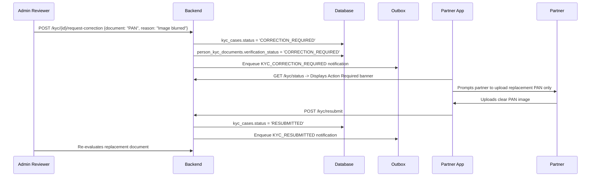

# BSDL ARCHITECTURE SPECIFICATION: MANDATORY PARTNER KYC & CASE GOVERNANCE

**Document Version:** 1.0.0  
**Authority:** Enterprise Architecture Governance Board  
**Target Systems:** `yp_executive_mobile`, `bs_admin_portal`, `bs_api_service`, `bs_database`  
**Classification:** CANONICAL KYC SPECIFICATION  
**Date:** October 3, 2026  
**Status:** `APPROVED_SPECIFICATION`

---

## 1. MANDATORY KYC TRIPLE REQUIREMENT

To achieve contractual compliance, regulatory alignment, and fraud prevention, every Channel Partner must complete three mandatory KYC verification pillars prior to application submission.

```
+-----------------------------------------------------------------------------------+
|                           MANDATORY KYC COMPONENTS                                |
+-----------------------------------------------------------------------------------+
| 1. Aadhaar Pillar   | Aadhaar Number (12 digits) + Document Upload (Front & Back) |
| 2. PAN Pillar       | PAN Number (10 alphanumeric) + PAN Document Upload          |
| 3. Bank Pillar      | Account Holder + Account No + IFSC + Bank Proof Document    |
+-----------------------------------------------------------------------------------+
```

---

## 2. DATA SCHEMA & CANONICAL MODELS

### 1. Canonical KYC Case (`workforce.kyc_cases`)
Tracks the overall lifecycle and review decisions for a partner's KYC submission.
```sql
CREATE TABLE workforce.kyc_cases (
    id UUID PRIMARY KEY DEFAULT gen_random_uuid(),
    tenant_id UUID NOT NULL REFERENCES organisation.organizations(id),
    partner_profile_id UUID NOT NULL REFERENCES workforce.org_workforce_profiles(id),
    person_id UUID NOT NULL REFERENCES identity.persons(id),
    status VARCHAR(50) NOT NULL DEFAULT 'NOT_STARTED', -- NOT_STARTED, IN_PROGRESS, READY_FOR_SUBMISSION, SUBMITTED, UNDER_REVIEW, CORRECTION_REQUIRED, RESUBMITTED, APPROVED, REJECTED
    submission_version INTEGER NOT NULL DEFAULT 1,
    submitted_at TIMESTAMPTZ,
    reviewed_at TIMESTAMPTZ,
    reviewed_by_account_id UUID REFERENCES identity.user_accounts(id),
    approved_at TIMESTAMPTZ,
    rejected_at TIMESTAMPTZ,
    rejection_reason_code VARCHAR(100),
    rejection_notes TEXT,
    correction_requested_at TIMESTAMPTZ,
    created_at TIMESTAMPTZ NOT NULL DEFAULT NOW(),
    updated_at TIMESTAMPTZ NOT NULL DEFAULT NOW()
);
CREATE INDEX idx_kyc_cases_tenant ON workforce.kyc_cases(tenant_id);
CREATE INDEX idx_kyc_cases_partner ON workforce.kyc_cases(partner_profile_id);
CREATE INDEX idx_kyc_cases_status ON workforce.kyc_cases(status);
```

### 2. KYC Document Evidence (`workforce.person_kyc_documents`)
Stores metadata and verification status for individual uploaded documents.
* `document_type`: `AADHAAR`, `PAN_CARD`, `BANK_PROOF`
* `document_side`: `FRONT`, `BACK`, `SINGLE`
* `document_number_hash`: SHA-256 HMAC of document number
* `storage_bucket`: `platform-private-documents` (strictly private object storage)
* `storage_path`: `/tenants/{tenant_id}/partners/{partner_id}/kyc/{doc_type}_{doc_id}.enc`
* `verification_status`: `PENDING`, `SUBMITTED`, `UNDER_REVIEW`, `VERIFIED`, `CORRECTION_REQUIRED`, `REJECTED`
* `correction_reason`: Targeted instructions provided by the admin reviewer

### 3. Encrypted Payout Profile (`workforce.member_payout_profiles`)
Stores sensitive banking coordinates with column-level encryption.
* `account_holder_name`: Must match or reconcile with partner's legal identity
* `account_number_encrypted`: AES-256-GCM ciphertext
* `account_number_last4`: Unencrypted last 4 digits for masked display
* `ifsc_code`: 11-character Indian Financial System Code
* `bank_name` & `branch_name`: Resolved automatically from IFSC registry
* `verification_status`: `PENDING`, `VERIFIED`

---

## 3. PROGRESSIVE ONBOARDING UX & STEPPER

The mobile partner onboarding flow breaks the KYC intake into discrete, non-intimidating steps with full save-and-resume capability.

```
Step 1: Aadhaar -> Step 2: PAN -> Step 3: Bank Account -> Step 4: Review & Submit
```

```
[ KYC Progress ]
[████████████████░░░░░░░░] Step 2 of 3: PAN Card
```

### Progressive Step Requirements
1. **Aadhaar Screen:**
   * Input: 12-digit Aadhaar number with auto-formatting (`XXXX XXXX XXXX`).
   * Documents: Front and Back photo/scan upload.
   * Client-side validation: Verhoeff checksum algorithm validation before upload.
2. **PAN Screen:**
   * Input: 10-character PAN number with automatic capitalization.
   * Validation regex: `^[A-Z]{5}[0-9]{4}[A-Z]{1}$`.
   * Document: Clear photo/scan upload of physical PAN card.
3. **Bank Account Screen:**
   * Input: Account Holder Name, Account Number, Confirm Account Number, IFSC Code.
   * Auto-Resolution: Backend queries IFSC registry to populate Bank Name (e.g. State Bank of India) and Branch Name (e.g. Ernakulam South).
   * Document: Cancelled cheque, passbook first page, or certified bank statement.
4. **Review & Final Submission Screen:**
   * Displays status checkmarks across Mobile, Email, Profile, Aadhaar, PAN, and Bank.
   * Partner taps `[ Submit for Verification ]`.
   * Submission Lock activated: All fields transition to read-only while under review.

---

## 4. DOCUMENT SECURITY & SENSITIVE DATA PROTECTION

### 1. Private Object Storage Architecture
* All KYC documents are stored in the private object bucket `platform-private-documents`.
* **Zero Public Access:** The storage bucket has public read disabled (`BlockPublicAcls = true`).
* **Authorized Access via Time-Limited Signed URLs:**
  * When an authorized reviewer opens an application, the backend verifies `WORKFORCE.KYC.READ` or `partner.kyc.review` permission.
  * The backend generates a pre-signed GET URL with a strict **5-minute TTL**.
  * No persistent public URLs are ever stored in the database or logged in application traces.

### 2. Sensitive Data Masking Standard
To prevent shoulder surfing and unauthorized data exposure, all administrative list endpoints and mobile profile views display sensitive numbers in masked form:

| Identifier | Raw Stored Representation | Masked Presentation Standard |
| :--- | :--- | :--- |
| **Aadhaar** | Salted SHA-256 Hash | `XXXX XXXX 1234` |
| **PAN Card**| Raw / AES-GCM Encrypted | `XXXXX1234X` |
| **Bank Account** | AES-256-GCM Ciphertext | `••••••••1234` |

---

## 5. GRANULAR CORRECTION WORKFLOW

Rejection must not be the default action for trivial document deficiencies (e.g. blurry image). The system implements a targeted correction cycle:



---
**Approved by:** Enterprise Architecture Governance Board
