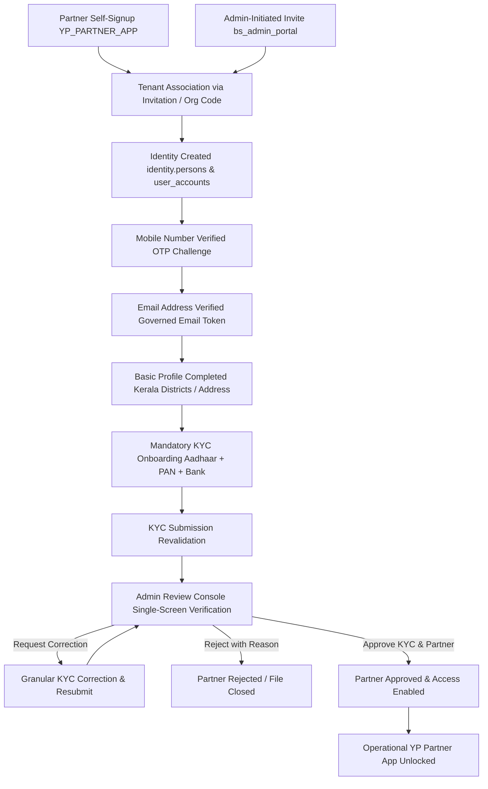

# BSDL ARCHITECTURE SPECIFICATION: UNIFIED PARTNER ONBOARDING & LIFECYCLE

**Document Version:** 1.0.0  
**Authority:** Enterprise Architecture Governance Board  
**Target Systems:** `yp_executive_mobile`, `bs_admin_portal`, `bs_api_service`, `bs_database`  
**Classification:** CANONICAL ARCHITECTURE SPECIFICATION  
**Date:** October 3, 2026  
**Status:** `APPROVED_SPECIFICATION`

---

## 1. ARCHITECTURAL OBJECTIVE

This specification unifies the Channel Partner onboarding lifecycle across two entry vectors:
1. **Partner Self-Signup:** Initiated by prospective partners directly from `YP_PARTNER_APP` (`yp_executive_mobile`).
2. **Admin-Initiated Onboarding:** Initiated by tenant administrators from `bs_admin_portal`.

**Fundamental Directive:** Both entry vectors converge into the exact same canonical backend domain model, identity verification, mandatory KYC validation, administrative review, and partner access enablement pipeline. No bypasses or parallel account models are permitted.



---

## 2. STATE DOMAIN SEPARATION

To eliminate ambiguity and prevent conflation of distinct security gates, the system enforces 5 independent state domains. A generic `verified = true` field is strictly prohibited.

```
+-----------------------------------------------------------------------------------+
|                              PARTNER STATE DOMAINS                                 |
+-----------------------------------------------------------------------------------+
| 1. Identity Domain    | email_verified (BOOLEAN), mobile_verified (BOOLEAN)       |
| 2. Profile Domain     | profile_completed (BOOLEAN)                               |
| 3. KYC Domain         | kyc_status (ENUM: NOT_STARTED, IN_PROGRESS, SUBMITTED...)  |
| 4. Review Domain      | review_status (ENUM: PENDING, UNDER_REVIEW, CORRECTION...) |
| 5. Access Domain      | partner_access_status (ENUM: INVITED, REGISTERED, ACTIVE..)|
+-----------------------------------------------------------------------------------+
```

### State Definitions & Permitted Transitions

#### Identity Domain
* `mobile_verified`: Set to `TRUE` strictly upon cryptographic validation of the SMS OTP challenge.
* `email_verified`: Set to `TRUE` strictly upon verification of the secure email token via the email verification API.

#### Profile Domain
* `profile_completed`: Set to `TRUE` when legal full name, date of birth, gender, residential address, district (validated against governed Kerala districts), state, and postal code are persisted.

#### KYC Domain (`workforce.kyc_cases.status`)
```
NOT_STARTED -> IN_PROGRESS -> READY_FOR_SUBMISSION -> SUBMITTED -> UNDER_REVIEW -> (APPROVED | CORRECTION_REQUIRED | REJECTED)
```

#### Partner Access Domain (`workforce.org_workforce_profiles.status`)
* `INVITED`: Invitation issued; account not yet claimed.
* `REGISTERED`: Account created; identity verification underway.
* `ONBOARDING_ONLY`: Identity verified, profile complete, KYC in progress/under review. Operational features strictly blocked.
* `ACTIVE`: KYC approved and administrative partner access granted. Operational features unlocked.
* `SUSPENDED`: Temporarily revoked by tenant administrator.
* `REJECTED`: Application denied. Access blocked.

---

## 3. TENANT ASSOCIATION & ANTI-ENUMERATION

Channel Partners are workforce participants within a specific Tenant organization (`organisation.organizations` with `organization_level = 'TENANT'`).

### Anti-Spoofing & Security Invariants
1. **No User-Supplied UUIDs:** The self-signup API strictly rejects arbitrary `organization_id` inputs from clients.
2. **Invitation Cryptographic Token:** Admin invitations issue a secure random token (stored in `identity.invitations` with 72-hour TTL). When redeemed in `YP_PARTNER_APP`, the backend securely resolves the associated `tenant_id` and pre-authorized workforce role (`DIGITAL_PARTNER` or `FIELD_EXECUTIVE`).
3. **Organisation Partner Code:** Tenants may publish an approved alphanumeric partner registration code. The backend resolves the code to the canonical `organization_id`.
4. **Duplicate Protection & Anti-Enumeration:** If a user attempts registration with an existing phone or email:
   * The backend does NOT reveal internal account details.
   * If existing account is `INVITED`, it prompts session continuation to verify email/OTP.
   * If existing account is `ACTIVE`, it routes to standard Sign-In.

---

## 4. ASYNCHRONOUS NOTIFICATIONS & RENDER WORKER INTEGRATION

All partner onboarding communications are dispatched via the tenant-isolated transactional outbox (`notifications.email_outbox`).

### Event Pipeline
```
Partner Event -> Outbox Enqueue (DB Tx) -> Worker Lock (SKIP LOCKED) -> Tenant SMTP Config -> Email Delivery
```

### Governed Notification Events
1. `PARTNER_SIGNUP_COMPLETED`: Acknowledges self-registration and delivers the Email Verification challenge.
2. `EMAIL_VERIFICATION_REQUIRED`: Issued when email challenge is resent.
3. `KYC_SUBMITTED`: Alerts tenant administrators of a pending KYC review case.
4. `KYC_CORRECTION_REQUIRED`: Informs partner of document correction instructions.
5. `KYC_RESUBMITTED`: Notifies reviewer that updated documents are available.
6. `PARTNER_APPROVED`: Congratulates partner and informs them that YP Partner operational access is enabled.
7. `PARTNER_REJECTED`: Delivers formal rejection notification with audit trail closure.

### Failure Isolation Invariant
If an email delivery fails (e.g. SMTP timeout), the database transaction for partner registration, KYC submission, or admin approval **MUST NOT ROLL BACK**. The email job transitions to `FAILED_RETRYABLE` in `notifications.email_outbox` and retries via the Render worker daemon with exponential backoff.

---
**Approved by:** Enterprise Architecture Governance Board
